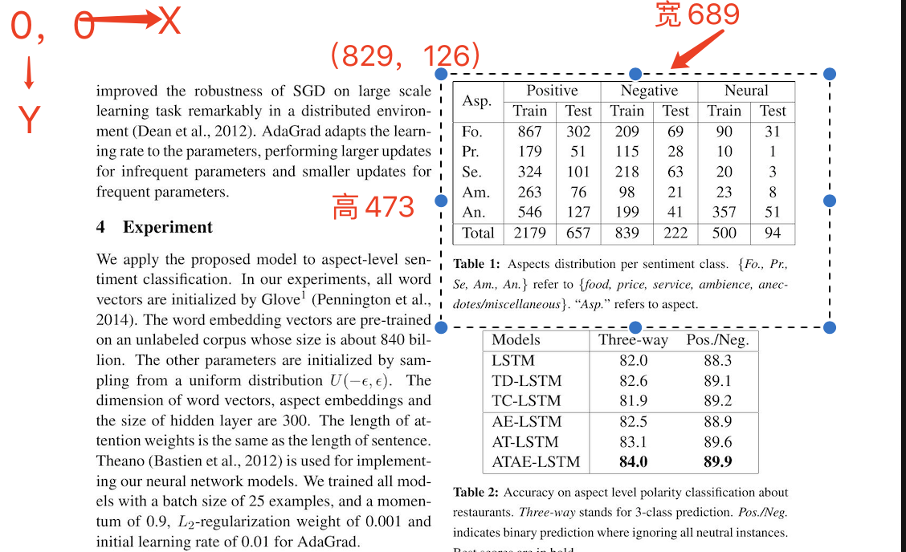

# 图像的应用
## 目标检测 Image object detection
### 文档: https://labelstud.io/templates/image_bbox.html
### 初始化项目
```buildoutcfg
label-studio init --template=image_bbox image_object_detection
label-studio start image_object_detection
#或者
label_studio/server.py start image_object_detection -b
```
### 标注的配置, 注意设置标签的类别
```buildoutcfg
<View>
  <Image name="image" value="$image"/>
  <RectangleLabels name="label" toName="image">
    <Label value="表格" background="green"/>
    <Label value="图像" background="blue"/>
    <Label value="公式" background="red"/>
  </RectangleLabels>
</View>
```
## 使用api
image_api.py

## 导入图片的方式
### 文档: https://labelstud.io/guide/tasks.html#Directory-with-image-files
#### 方法1， 通过目录导入，在初始化阶段目录就有图片
label-studio init -i /my/dataset/images --input-format image-dir
#### 方法2, 通过http或https导入,
Your JSON/CSV/TSV/TXT must contain http/https URLs to them.
* 进入一个图片的目录，启动一个简易的http, 例如： python3 -m http.server 9090
* 扫描每张图片，并通过api上传的格式如:
```buildoutcfg
    data = [{'image': 'http://127.0.0.1:9090/IMG_1505.JPG'},
            {'image': 'http://127.0.0.1:9090/IMG_1506.JPG'}]
    r = requests.post(host + "project/import", data=json.dumps(data), headers=headers)
    pp.pprint(r.json())
```
### 标注说明
```buildoutcfg
{
 "completions": [
  {
   "created_at": 1613720246,
   "id": 379001,
   "lead_time": 9.071,
   "result": [
    {
     "from_name": "label",
     "id": "-_hUyJkW97",
     "image_rotation": 0,
     "original_height": 2200,
     "original_width": 1700,
     "to_name": "image",
     "type": "rectanglelabels",
     "value": {
      "height": 21.52420185375901, #也是百分比,height*original_height 得到的是矩形的高,0.2152*2200=473.4400
      "rectanglelabels": [
       "\u8868\u683c"
      ],
      "rotation": 0,
      "width": 40.53333333333333,    #也是百分比，width*original_width 得到是矩形的宽  0.405333*1700 = 689.066100
      "x": 48.8,  #  是百分比，矩形框的左上角的坐标, x * original_width得到的是矩形框的左上角的x的实际位置。 0.488*1700=829.600
      "y": 5.76725025746653 # 也是百分比，矩阵左上角y坐标, y*original_height得到的是矩形框的左上角的y的实际位置。 0.0576725025746653*2200=126.8795056642636600
     }
    },
    {
     "from_name": "label",
     "id": "Pi1WP5gORU",
     "image_rotation": 0,
     "original_height": 2200,
     "original_width": 1700,
     "to_name": "image",
     "type": "rectanglelabels",
     "value": {
      "height": 21.318228630278064,
      "rectanglelabels": [
       "\u8868\u683c"
      ],
      "rotation": 0,
      "width": 38.4,
      "x": 49.86666666666667,   
      "y": 27.703398558187434
     }
    }
   ]
  }
 ],
 "data": {
  "image": "http:\/\/192.168.50.86:9090\/Attention-based_LSTM_for_Aspect-level_Sentiment_ClassificationD16-10580001-06.jpg"
 },
 "id": 379
}
```
上面的示例图


### 标注后导出为COCO格式
```buildoutcfg
pip install git+https://github.com/heartexlabs/label-studio-converter.git
# 导出的结果
2021-02-18-17-55-04-COCO/
├── images
│   ├── IMG_1505_2101.JPG     #图片名称+md5部分字段+后缀
│   └── IMG_1506_c2fe.JPG
└── result.json     #数据标注结果

```
如果导出YOLO格式, YOLO格式只支持目标检测的矩形框
```buildoutcfg
pip install git+https://github.com/johnson7788/label-studio-converter.git
```

## 后端启动,辅助标记
1. 启动
```buildoutcfg
python my_ml_backend/object_wsgi.py --log-level DEBUG --debug --port 5055
```
2. 在label-studio的模型设置下，添加,http://0.0.0.0:5055

3. 开始打标签
